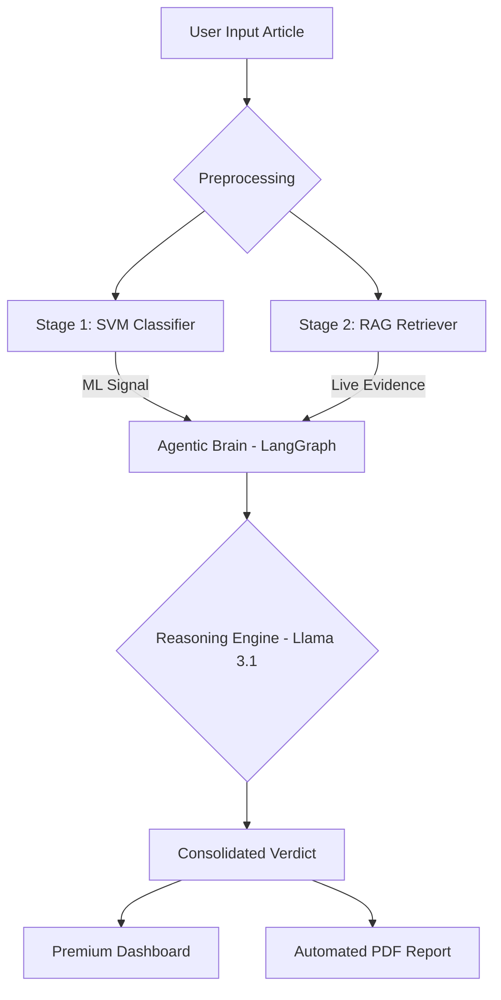

# AI News Credibility Assistant

### *Integrated Intelligence Platform | Real-Time Misinformation Monitoring*

[](https://www.python.org/)
[](https://streamlit.io/)
[](https://groq.com/)
[](https://github.com/langchain-ai/langgraph)

A comprehensive hybrid classification system designed to evaluate the credibility of news articles using high-performance machine learning (SVM) and agentic RAG (Retrieval-Augmented Generation) reasoning.

---


## Project Overview
This project evolved from a standalone machine learning classifier into a full-scale **Agentic Intelligence Platform**. By combining traditional linguistic analysis with real-time web verification and LLM-based reasoning, it provides a deep, multi-dimensional assessment of news credibility.

---

## The 3-Stage Validation Engine

Our system processes news through three rigorous layers of validation:

### Stage 1: Machine Learning Signal (SVM)
The core engine uses a **Linear Support Vector Machine (SVM)** trained on the **WELFake dataset** (72,000+ articles). It analyzes:
- **Linguistic Fingerprints**: Passive vs. active voice, sensationalism, and punctuation patterns.
- **Statistical Patterns**: TF-IDF vectorization with unigram and bigram analysis (10,000 max features).

### Stage 2: RAG Verification (Live Evidence)
The system performs real-time searches across global fact-checking repositories to find corroborating or conflicting evidence.
- **Dynamic Scraping**: Fetches the latest updates from Snopes, AP, PolitiFact, and Reuters.
- **Consensus Analysis**: Evaluates whether retrieved sources support or debunk the input claim.

### Stage 3: Agentic Reasoning (Cognitive Synthesis)
Powered by **LangGraph** and **Groq (Llama 3.1)**, an autonomous agent synthesizes the ML signal and live evidence.
- **Conflict Resolution**: Resolves discrepancies between linguistic patterns (ML) and actual facts (RAG).
- **Consolidated Verdict**: Generates a professional rationale with confidence scoring.

---

## System Architecture



---

## Key Features

- **Parallel Agentic Workflow**: Built with LangGraph to process ML and evidence streams concurrently, reducing latency.
- **Live RAG Integration**: Real-time scraper and vector-based retrieval for fresh fact-checks.
- **Premium Dark-Blue Dashboard**: A custom-styled Streamlit UI with interactive charts, metrics, and progress bars.
- **Automated PDF Reporting**: Generates a professional deep-dive report (via FPDF2) for offline sharing.
- **Session History & Analytics**: Track trends in news credibility assessments over time.

---

## Performance Metrics

| Metric | Milestone 1 (20k Sample) | Milestone 2 (Full Optimization) |
| :--- | :--- | :--- |
| **Accuracy** | 94.30% | **96.55%** |
| **Precision** | 93.96% | 95.96% |
| **Recall** | 94.88% | 96.88% |
| **F1-Score** | 94.42% | 96.42% |

---

## Technology Stack

| Category | Technology |
| :--- | :--- |
| **Frontend** | Streamlit, Vanilla CSS (Inter/Outfit Fonts) |
| **ML Engine** | Scikit-learn, Joblib, NLTK |
| **Agentic Core** | LangGraph, LangChain, Groq Cloud |
| **Models** | Linear SVM (Base), Llama 3.1 70B (Reasoning) |
| **RAG / Search** |FAISS |

---

## Project Setup Guide

### 1. Prerequisites
- Python 3.9 or higher
- A Groq API Key ([Get one here](https://console.groq.com/))

### 2. Installation
```bash
# Clone the repository
git clone https://github.com/ashvin2005/AI_ML_project.git
cd AI_ML_project
 


pip install -r requirements.txt
```

### 3. Running the App
1. Launch the Streamlit server:
   ```bash
   streamlit run app_final.py
   ```
2. Enter your **Groq API Key** in the sidebar.
3. Paste an article and click **"Run AI Analysis"**.

---

## Project Structure

```text
├── milestone1/
│   ├── app.py                # Legacy M1 UI (Pure ML)
│   ├── model.ipynb           # Model training and optimization
│   └── *.joblib              # Serialized SVM & Vectorizer
├── milestone2/
│   └── agent/                # Agentic reasoning logic
│       ├── graph.py          # LangGraph workflow definition
│       ├── retriever.py      # Live RAG & Scraping logic
│       └── reasoner.py       # Llama 3.1 reasoning templates
├── app_final.py              # Integrated Premium UI (Final)
├── ARCHITECTURE.md           # Deep dive into NLP pipeline
└── requirements.txt          # Full project dependencies
```

---


